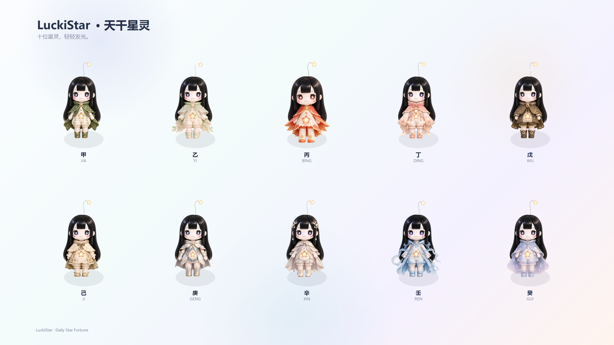

# LuckiStar · 每日星运（抖音小程序）

面向年轻人，在通勤/睡前用“抽签 + 打卡 + 盲盒收集”培养幸运习惯：接纳当下、发现生活里的小美好。



若上图无法显示，可在抖音开发者工具中截图首页或打开 `assets/luckistar_tiangan_poster_4k.png` 替换本图。

## 功能概览

| 模块 | 路径 | 说明 |
|---|---|---|
| 首页（每日好运仪式） | `pages/home/index` | 今日星运概览（九宫格）/ 今日星光签 / 今日好运任务 / 分享与打卡 |
| 星光广场 | `pages/plaza/index` | 浏览与发布小幸运，点亮互动，形成社区回访 |
| 星灵图鉴 | `pages/gallery/index` | 盲盒收集与解锁 60 位日柱星灵，进入详情查看档案与建议 |
| 出生信息 | `pages/birth/index` | 昵称、出生日期/时间、出生省市，生成星运坐标 |
| 召唤流程 | `pages/summon/index` | 真太阳时校正 + 日柱计算，召唤本命 LuckiStar |
| 星运档案 | `pages/archive/index` | 星盘小屋 / 八字星册 / 紫微星图（可分享卡片） |

## 核心闭环

输入出生信息 → 召唤本命星灵 → 每日抽星光签/做好运任务 → 记录幸运事件 → 发布到星光广场 → 点亮互动 → 获得碎片 → 开盲盒解锁星灵 → 完善个人档案。

## 技术栈

- 抖音小程序原生（TTML / TTSS / JS）
- 本地数据与缓存：`data/`、`utils/storage.js`
- 命理与档案：`utils/bazi.js`、`utils/archiveProfiles.js`
- 每日内容生成：`utils/dailyLuck.js`
- 社区广场：`utils/plaza.js`

## 本地运行

1. 安装抖音小程序开发者工具。
2. 导入本项目根目录（含 `app.json`、`project.config.json`）。
3. 运行后进入首页体验主流程。

## 本地检查

```bash
node tests/bazi.test.js
```

## 目录结构（摘要）

```
luckistar/
├── app.js / app.json / app.ttss
├── assets/ # 图标、星灵素材、海报等
├── pages/ # 首页/广场/图鉴/档案/出生/召唤等页面
├── components/ # luckistar-avatar 组件
├── data/ # 省市经纬度、星灵数据
├── utils/ # 运势生成、命理计算、缓存与奖励
└── tests/ # 轻量测试
```

## 说明

- 本项目为轻互动娱乐体验，不代表确定预测。
- 当前社区与部分内容为本地 mock + 缓存版本，适合 Demo 与交互验证。
